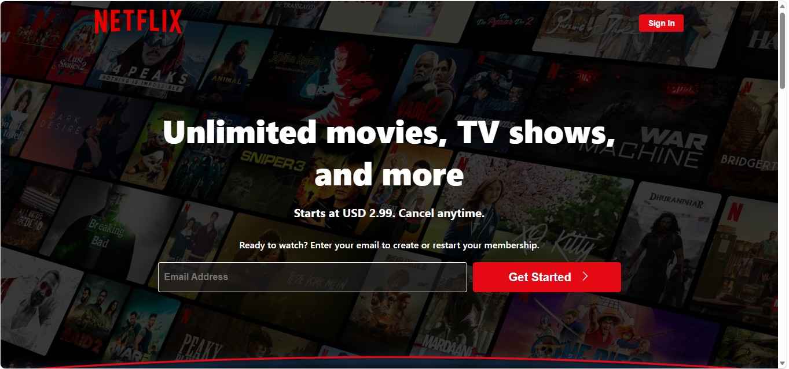

# 🎬 Netflix Nepal Clone (Frontend Project)

A responsive frontend clone of the Netflix landing page built using **HTML and CSS**.  
This project is created for learning purposes and portfolio showcase.

---

## 🚀 Live Demo
(Add your GitHub Pages or Netlify link here after deployment)

---

## 📸 Preview

  

## 🚀 Live Demo

👉 https://kbcode003.github.io/netflix-clone/

## 🛠️ Tech Stack

- HTML5
- CSS3 (Flexbox + Grid)
- Responsive Design (Media Queries)

---

## ✨ Features

- Netflix-style landing page UI
- Fully responsive design for mobile, tablet, and desktop
- Hero section with background overlay
- Email input + CTA button layout
- Trending movies scroll section
- Feature cards section
- FAQ section layout
- Footer with links and language selector
- Hover effects and smooth UI interactions

---

## 📱 Responsive Design

This project is optimized for:
- Mobile devices
- Tablets
- Desktop screens

---

## 📂 Project Structure
Netflix-Clone/
│
├── index.html
├── styles.css
├── preview.png
├── README.md

---

## 🧠 What I Learned

- Structuring real-world UI layouts
- Flexbox and Grid systems
- Responsive design techniques
- CSS positioning and overlays
- Building reusable UI components

---

## 🚀 Future Improvements

- Add JavaScript interactivity (FAQ toggle, form validation)
- Improve animations and transitions
- Add multiple pages (login, browse page)
- Deploy using GitHub Pages / Netlify

---

## 👨‍💻 Author

- GitHub: [KBcode003](https://github.com/KBcode003)

---

## ⚠️ Disclaimer

This project is a UI clone made for educational purposes only.  
All design credits belong to Netflix.